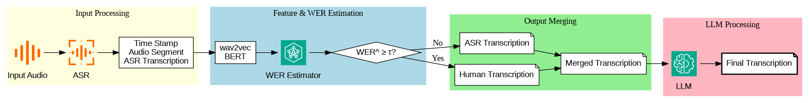
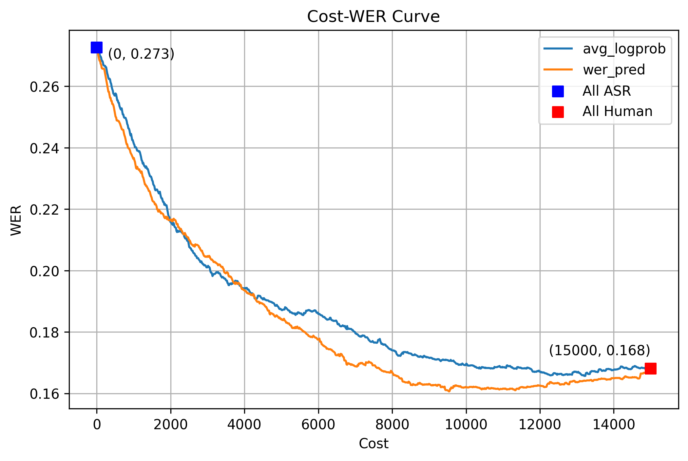

# Human-in-the-Loop Transcribe

音声認識モデル（Whisper）と機械学習による誤認識予測、さらに人間による補正を組み合わせた文字起こしワークフローです。

---

## 🚀 概要

本プロジェクトは以下を統合した音声文字起こしパイプラインを提供します：

- 🎙️ Whisperによる日本語音声の自動文字起こし
- 📊 MLPベースのWER（誤り率）予測モデル
- 🧑‍💻 ユーザーが高WER予測セグメントのみを効率的に補正
- 🧠 GPT-4.1による最終文の校正と要約（オプション）

---

## 🧩 パイプライン図

---

## 📈 成果と効果

- ✅ **人間がすべてを文字起こしする場合に比べて、約 40% のコスト削減**
- ✅ 精度低下を **わずか 0.5% 未満に抑制**
- ✅ 入力音声は約5秒ごとに自動分割、**誤認識が多くなりそうな箇所だけ人間が修正**
- ✅ 最終的な文は LLM（GPT-4.1）によって校正・要約され、読みやすく整形
- ✅ **「誤認識が多い」とみなす閾値（WER）は設定可能**

---

## 💻 使用方法（Notebook）

### 🔸 既存の訓練済みモデルを使う場合

誤認識予測（WER予測）モデルをそのまま使いたい場合は、以下のノートブックを実行してください：

👉 [`human_in_the_loop_transcribe.ipynb`](human_in_the_loop_transcribe.ipynb)

このノートブックでは、事前に学習されたMLPモデルとスケーラーを用いて、音声セグメントに対するWERスコアを自動予測します。

---

### 🔸 自分でモデルを訓練したい場合

独自の音声データセットを使ってWER予測モデルを訓練したい場合は、以下のノートブックを使用してください：

👉 [`training-mlp.ipynb`](training-mlp.ipynb)

このノートブックでは、Wav2Vec2 + BERT特徴量に基づくMLP回帰モデルを訓練し、実験を再現できます。

---